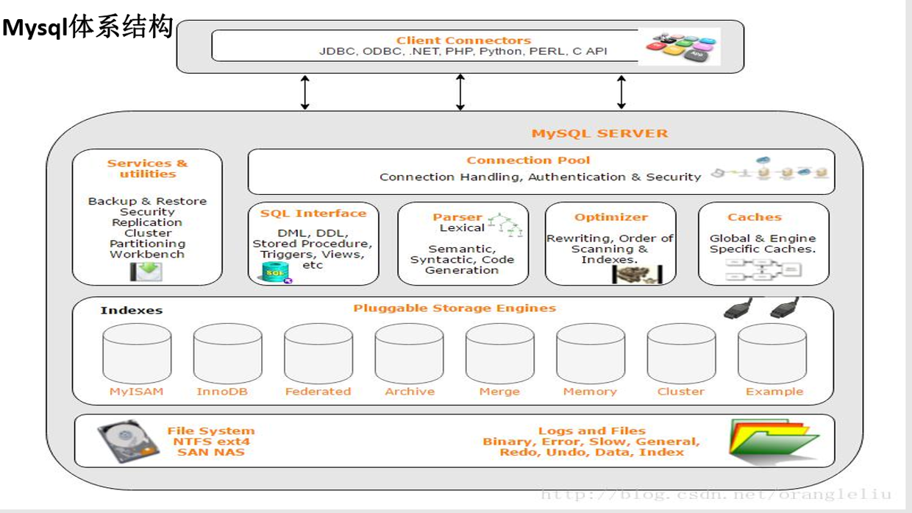
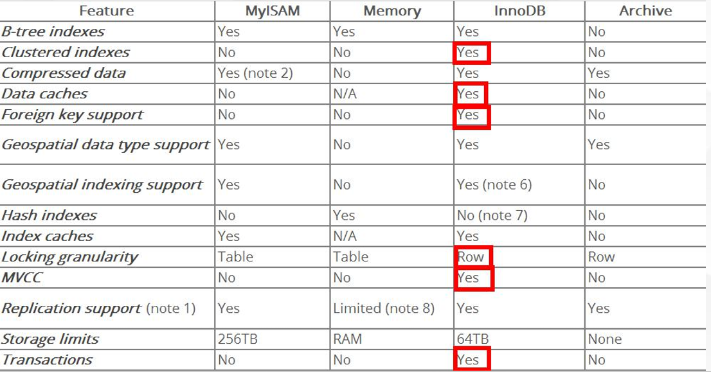
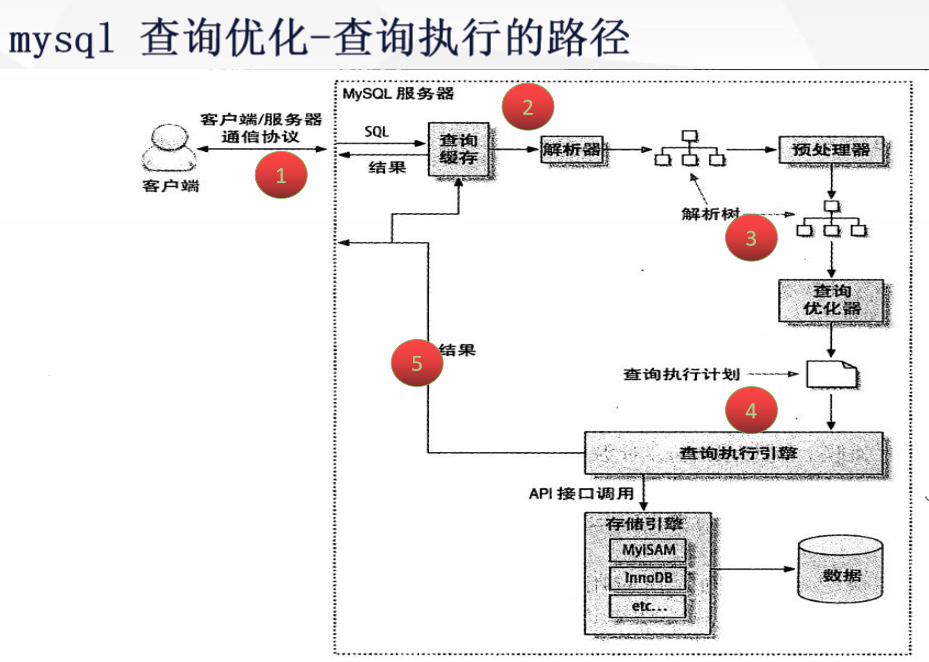

---

typora-copy-images-to: assets
---

*打油诗*

  >全值匹配我最爱，最左前缀要遵守；
  > 带头大哥不能少，中间兄弟不能断；
  >  索引列上少计算，范围之后全失效；
  > LIKE百分写最右，覆盖索引不写星；
  > 不等空值还有or，索引失效要少用;
### 01 mysql的体系结构



### 各大存储引擎介绍
- 插拔式的存储引擎
- 存储引擎是指制定在表之上的，即每一个库的每一张表都可以指定自己的存储引擎
- 不管表采用什么存储引擎，都会在数据区产生对应的一个后缀为frm的文件（表结构定义描述文件）
##### csv存储引擎
数据存储以csv文件
特点：
- 不能定义没有索引、列定义必须为NOT NULL、不能设置自增列 -->不适用大表或者数据的在线处理
- CSV数据的存储用,隔开，可直接编辑CSV文件进行数据的编排 -->数据安全性低
>注：编辑之后，要生效使用flush table XXX 命令
>应用场景： 数据的快速导出导入 表格直接转换成CSV

##### Archive存储引擎
压缩协议进行数据的存储
特点：
- 只支持insert和select两种操作
- 只允许自增ID列建立索引
- 行级锁
- 不支持事务
- 数据占用磁盘少

**应用场景：**
- 日志系统
- 大量的设备数据采集
##### Memory|heap存储引擎
数据都是存储在内存中，IO效率比其他引擎高很多 服务重启数据丢失，内存数据表默认只有16M
特点：
- 支持hash索引，B tree 索引，默认hash（查找复杂度O(1)）
- 字段长度都是固定长度varchar(32)=char(32) 
- 不支持大数据存储类型字段如 blog，text 
- 表级锁
>引用场景:
>1.等值查找热度较高数据  
>2.查询结果内存中的计算，大多数都是采用这种存储引擎 作为临时表存储需计算的数据


##### Myisam
Mysql5.5版本之前的默认存储引擎 ，较多的系统表也还是使用这个存储引擎，系统临时表也会用到Myisam存储引擎
特点：
- select count（*）from table无需进行数据的扫描
- 数据（MYD）和索引（MYI）分开存储
- 表级锁
- 不支持事务
##### innodb
mysql5.5以及以后版本的默认存储引擎
KEY Advantages：
1. Its DML operations follow the ACID model【事务ACID】
2. Row-level locking【行级锁】
3. InnoDB tables arrange your data on disk to optimize queries based on primary keys【聚集索引（主键索引）方式进行数据存储】
4. To maintain data integrity，InnoDB supports FOREIGN KEY contains【支持外键关系保证数据完整性】
#### 各存储引擎对比
>[https://dev.mysql.com/doc/refman/5.7/en/storage-engines.html](https://dev.mysql.com/doc/refman/5.7/en/storage-engines.html)
>

### 02 mysql体系结构和运行机理
1. Client Connectors 接入方 支持协议很多
2. Management Serveices & Utilities 系统管理和控制工具，mysqldump、 mysql复制集群、分区管理等
3. Connection Pool 连接池：管理缓冲用户连接、用户名、密码、权限校验、线程处理等需要缓存的需求 
4. SQL Interface SQL接口：接受用户的SQL命令，并且返回用户需要查询的结果 
5. Parser 解析器，SQL命令传递到解析器的时候会被解析器验证和解析。解析器是由Lex和YACC实现的
6. Optimizer 查询优化器，SQL语句在查询之前会使用查询优化器对查询进行优化
7. Cache和Buffer（高速缓存区） 查询缓存，如果查询缓存有命中的查询结果，查询语句就可以直接去查询缓存中取数据
8. pluggable storage Engines 插件式存储引擎。存储引擎是MySql中具体的与文件打交道的子系统
9. file system 文件系统，数据、日志（redo，undo）、索引、错误日志、查询记录、慢查询等
### 03 mysql查询优化详解
####  查询优化-查询执行的路径


   **各阶段:**
- mysql 客户端/服务端通信
- 查询缓存
- 查询优化处理
- 查询执行引擎
- 返回客户端

##### 一 mysql客户端/服务端通信
- Mysql客户端与服务端的通信方式是“半双工”；

概念：
1. 全双工：双向通信，发送同时也可以接收 
2. 半双工：双向通信，同时只能接收或者是发送，无法同时做操作 单工：只能单一方向传送
3. 半双工通信： 在任何一个时刻，要么是有服务器向客户端发送数据，要么是客户端向服务端发 送数据，这两个动作不能同时发生。所以我们无法也无需将一个消息切成小块进 行传输
>特点和限制： 客户端一旦开始发送消息，另一端要接收完整个消息才能响应。 客户端一旦开始接收数据没法停下来发送指令。

##### mysql客户端/服务端通信-查询状态
&emsp; 对于一个mysql连接，或者说一个线程，时刻都有一个状态来标识这个连接正在做什么
查看命令 ```show full processlist/show processlist```
>https://dev.mysql.com/doc/refman/5.7/en/general-thread-states.html

sleep
线程正在等待客户端发送数据
Query
连接线程正在执行查询
Locked
线程正在等待表锁的释放
Sorting result
线程正在对结果进行排序
Sending data
像请求端返回数据
可通过kill{id}的方式杀掉连接

##### 二 查询缓存
工作原理：
- 缓存select操作的结果集和sql语句；
- 新的select语句，先去查询缓存，判断是否存在可用的记录级；

>判断标准：
>与缓存的sql语句，是否完全一样，区分大小写（简单认为存储了一个key-value结构，key为sql，value为sql查询结果集）

**query_cache_type**
值: 0--不启用查询缓存，默认值；
1-- 启用查询缓存，只要符合查询缓存的要求，客户端的查询语句和记录集都可以缓存起来，供其他客户端使用，加上SQL_NO_CHCHE 将不缓存；
2-- 启用查询缓存，只要查询语句中添加了参数：SQL_CHCHE,且符合查询缓存的要求，客户端的查询语句和记录集，则可以缓存起来，供其他客户端使用
**query_cache_size**
允许设置query_chche_size的值最小为40K，默认1M，推荐设置为 64M/128M；
**query_cache_kimit**
限制查询缓存区最大能缓存的查询记录集，默认设置为1M
```show status like 'Qcache%'```命令可查看缓存情况
###### 查询缓存--不会缓存的情况
1. 当查询语句中有一些不确定的数据时，则不会被缓存。如包含函数NOW（），CURRENT_DATE() 等类似的函数，或者用户u自定义的函数，存储函数，用户变量等都不会被缓存
2. 当查询的结果大于```query_cache_limit```设置的值时，结果不会被缓存
3. 对于InnoDB引擎来说，当一个于在事务中修改了某个表，那么在这个事务提交之气那，所有与这个表相关的查询都无法被缓存。因此长时间执行事务，会大大降低缓存命中率
4. 查询的表时系统表
5. 查询语句不涉及到表
###### 查询缓存--是一个坑？
为什么mysql默认关闭了缓存计算？
1. 在查询之前必须先检查是否命中缓存，浪费计算资源
2. 如果这个查询可以被缓存，那个执行完成后，MYSQL发现查询缓存中没有这个查询，则会将结果存入查询缓存，这将带来额外的系统消耗
3. 针对表进行写入或封信数据时，将对应表的所有缓存都设置失效。
4. 如果查询缓存很大或者碎片很多时，这个操作可能带来很大的系统消耗
###### 查询缓存--使用业务场景
以读为主的业务，数据生成之后就不常改变的业务。 比如：门户类、新闻类、报表类、论坛类等
### 三 查询优化处理
**查询优化处理的三个阶段:**
- 解析sql
  通过lex词法分析，yacc语法分析将sql语句解析成解析树
>https://www.ibm.com/developerworks/cn/linux/sdk/lex/

- 预处理阶段
  根据mysql的语法的规则进一步检查解析树的合法性，如：检查数据的表和列是否存在，解析名字和别名的设置。还会进行权限的验证
- 查询优化器
   优化器的主要作用就是找到最优的执行计划
   **查询优化器怎么找到最优执行计划**
- 使用等价变化规则
  5=5 and a>5 改写成a>5
  a<b and a=5 改写成b>5 and a=5
  基于联合索引，调整条件位置等
- 优化count、min、max等函数
  min函数只需找索引最左边
  max函数只需找索引最右边
  myisam引擎count(*)
- 覆盖索引扫描
- 子查询优化
- 提前终止查询
   用了limit关键字或者使用不存在的条件
- in的优化
   先进性排序，在采用二分查找的方式

总结：mysql的查询优化器是基于成本计算的原则。他会尝试各种执行计划。数据抽样的方式进行试验（随机的读取一个4K的数据块进行分析）
**执行计划-id**
select查询的序列号，标识执行的顺序
1. id相同，执行顺序由上至下
2. id不同，如果时子查询，id的序号会递增，id值越大优先级越高，越先被执行
3. id相同又不同即两种情况同时存在，id如果相同，可以认为时以组，从上往下顺序执行；在所有组中，id越大，优先级越高，越先执行

**执行计划-select_type**
查询的类型，主要时用于区分普通查询、联合查询、子查询等
1. SIMPLE：简单的select查询，查询中不包含子查询或者union 
2. PRIMARY：查询中包含子部分，最外层查询则被标记为primary 
3. SUBQUERY/MATERIALIZED：SUBQUERY表示在select 或 where列表中包含了子查询
4. MATERIALIZED表示where 后面in条件的子查询
5. UNION：若第二个select出现在union之后，则被标记为union；
6. UNION RESULT：从union表获取结果的select

**执行计划-table**
查询涉及到的表
 直接显示表名或者表的别名
<unionM,N> 由ID为M,N 查询union产生的结果
<subqueryN> 由ID为N查询生产的结果

**执行计划-type**
>访问类型，sql查询优化中一个很重要的指标，结果值从好到坏依次是： system > const > eq_ref > ref > range > index > ALL 

- system：表只有一行记录（等于系统表），const类型的特例，基本不会出现，可以忽略不计
- const：表示通过索引一次就找到了，const用于比较primary key 或者 unique索引
- eq_ref：唯一索引扫描，对于每个索引键，表中只有一条记录与之匹配。常见于主键 或 唯一索引扫描
- ref：非唯一性索引扫描，返回匹配某个单独值的所有行，本质是也是一种索引访问
- range：只检索给定范围的行，使用一个索引来选择行
- index：Full Index Scan，索引全表扫描，把索引从头到尾扫一遍
- ALL：Full Table Scan，遍历全表以找到匹配的行

**执行计划-possible_keys、key、rows、filtered**
- possible_keys 查询过程中有可能用到的索引
- key 实际使用的索引，如果为NULL，则没有使用索引 
- rows 根据表统计信息或者索引选用情况，大致估算出找到所需的记录所需要读取的行 数
- filtered 它指返回结果的行占需要读到的行(rows列的值)的百分比 表示返回结果的行数占需读取行数的百分比，filtered的值越大越好

**执行计划-Extra**
十分重要的额外信息
1. Using filesort ： mysql对数据使用一个外部的文件内容进行了排序，而不是按照表内的索引进行排序读取
2. Using temporary： 使用临时表保存中间结果，也就是说mysql在对查询结果排序时使用了临时表，常见于order by 或 group by 
3. Using index： 表示相应的select操作中使用了覆盖索引（Covering Index），避免了访问表的数据行，效率高 
4. Using where ： 使用了where过滤条件
5. select tables optimized away： 基于索引优化MIN/MAX操作或者MyISAM存储引擎优化COUNT(*)操作，不必等到执行阶段在进行计算，查询执行 计划生成的阶段即可完成优化
### 四 查询执行引擎

调用插件式的存储引擎的原子API的功能进行执行计划的执行

### 五 返回客户端
1. 有需要做缓存的，执行缓存操作
2. 增量的返回结果：
    开始生成第一调结果时，mysql就开始往请求方逐步返回数据
    好处：mysql服务器无需保存过多的数据，浪费内存。用户体验好，马上就拿到了数据
####  如何定位慢sql
1. 业务驱动
2. 测试驱动
3. 慢查询日志
##### 慢查询日志配置
```
show variables  like 'slow_query_log'
set global slow_query_log = on
set global slow_query_log_file = '/var/lib/mysql/gupaoedu-slow.log'
set global log_queries_not_using_indexes = on 
set global long_query_time  = 0.1  (秒)
```
##### 慢查询日志分析
- Time ：日志记录的时间
- User@Host：执行的用户及主机
- Query_time：查询耗费时间 Lock_time 锁表时间  Rows_sent 发送给请求方的记录 条数  Rows_examined 语句扫描的记录条数
- SET timestamp  语句执行的时间点
- select ....             执行的具体语句
##### 慢查询日志分析工具
```shell
mysqldumpslow -t 10 -s at /var/lib/mysql/gupaoedu-slow.log
```