[TOC]

# 一 事务

 ## 什么是事务
> 事务是数据库操作的最小单元，是作为单个逻辑工作单元执行的一系列操作；事务时以组不可再分割的操作集合（工作逻辑单元）；
1. 通俗来说就是 事务中的每一个操作 都是全部失败或者全部成功，不会出现第三种状态。
2. 典型事务场景（转账）：
```
update user_account set balance=balance-1000 where userID =3;
udate user_account set balance=balance+1000 where userID =1;
```
3. mysql中怎么开启事务：
```
begin/ start transaction  -- 手工
commit /rollback   -- 事务提交或回滚
set session autocommit= on/off -- 设定事务是否自动开启
```
  + 3.1 JDBC编程
```java
connection.setAutoCommit(boolean);
```
  + 3.2 spring 事务AOP编程
```
expression=execution(com.gpedu.*.*(..))
```
4. 事务ADID特性
+ 原子性（Atomicity）
		最小的工作单元，整个工作单元要么一起提交成功，要么全部失败回滚
+ 一致性（Consistency）
		事务中操作的数据及状态改变是一致的，即写入资料的结果必须完全符合预设的规则，不会因为出现系统意外等原因导致状态的不一致
+ 隔离性（Isolation）
		一个事务所操作的数据在提交之前，对其他事务的可见性设定（一般设定为不可见）
+ 持久性（Durability）
		事务所作的修改就会永久保存，不会因为系统意外导致数据的丢失

## 事务并发带来的问题
+ 脏读 
  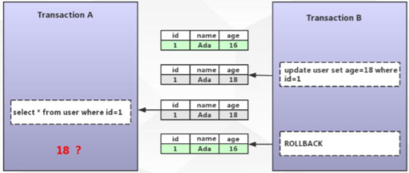
  A事务 查询到了 B事务更新的数据，之后B事务将数据回滚，造成次数据在数据库不存在，而A事务查询到了的情况，谓之脏读（常见于update）。

+ 不可重复读  

  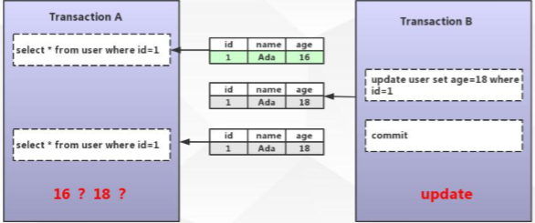
  A事务 查询了一次数据后，B事务将数据修改了，A事务再去查询的时候前后的 数据不一致，谓之不可重复读（常见于update）。

+ 幻读
  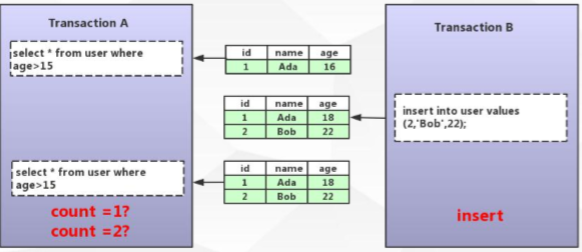
  A事务 查询数据，查询到了1条数据，事务还没有结束的时候，B事务插入了一条数据，然后A事务再去查询的时候 变为了两条数据，谓之幻读（所谓幻，即不确定是否存在与否。常见于insert）。

## 事务四种隔离级别
### 概念
+ Read Uncommitted（未提交读）-- 未解决并发问题
  事务未提交前对其他事务也是可见的，脏读（dirty read）

+ Read Committed（提交读）    -- 解决脏读问题
  一个事务开始之后，只能看到自己提交的事务所作的修改，不可重复读（nonrepeatable read）

+ Repeatable Read(可重复读)    -- 结局不可重复读问题
  在同一个事务中多次读取同样的数据结果是一样的，这种隔离级别未解决幻读的问题

+ Serializable（串行化）    --解决所有问题
  最高的隔离级别，通过强制事务的串行执行

### innodb引擎对隔离级别的支持程度

|        事务隔离级别         | 脏读   | 不可重复读 | 幻读            |
| :-------------------------: | ------ | ---------- | --------------- |
| 未提交读(Read Uncommitted) | 可能   | 可能       | 可能            |
| 已提交读（Read Committed）  | 不可能 | 可能       | 可能            |
| 可重复读（Repeatable read） | 不可能 | 不可能     | 对InnoDB不可能 |
|   串行化（Serializable）   | 不可能 | 不可能     | 不可能          |

   

# 二 锁

## 表锁、行锁

锁是用于管理不同事务对共享资源的并发访问

表锁和行锁的区别：

| 锁定粒度 | 表锁＞行锁 |
| -------- | ---------- |
| 加锁效率 | 表锁＜行锁 |
| 冲突概率 | 表锁＞行锁 |
| 并发性能 | 表锁＜行锁 |

InnoDB存储引擎支持行锁和表锁（另类的行锁，把所有行都锁住就是表锁）

## MySQL InnoDB锁类型

-  共享锁（行锁）：Shared Locks 

-  排它锁（行锁）：Exclusive Locks 

-  意向锁共享锁（表锁）：Intention Shared  Locks 

- 意向锁排它锁（表锁）：Intention Exclusive Locks 

- 自增锁：AUTO-INC Locks

​    行锁的算法

- 记录锁 Record Locks 

- 间隙锁 Gap Locks 

- 临键锁 Next-key Locks 

### 共享锁（Shared Locks）vs 排它锁（Exclusive Locks）

共享锁：

​	又称为读锁，简称s锁，共享锁就是多个事务对于同一个数据可以共享一把锁，都能访问到数据，但是只能读不能修改；

加锁释锁方式;

```	sql
select * from users where id=1 LOCK IN SHARE MODE;
commit/rollback
```

排它锁：

​	又称为写锁，简称x锁，排它锁不能与其他锁并存，如一个事务获取了一个数据行的排它锁，其他事物就不能再获取该行的锁（共享锁，排它锁），只有该获取了排它锁的事务是可以对数据行进行读取和修改（其他事务读取数据可来自于快照）

```
delete/update/insert 默认加上X锁
SELECT * FROM table_name WHERE ...FOR UPDATE
commit/rollback
```

### innodb一行所到底锁了什么

​	InnoDB的行锁是通过给索引上的索引项加锁来实现的。

​	只有通过索引条件进行数据检索，InnoDB才使用行级锁，否则，InnoDB将使用表锁（锁住索引的所有记录）

​	表锁:  `lock tables xx read/write`

### 意向锁共享锁（IS）&意向锁排它锁（IX）

意向共享锁（IS）

​	表示事务准备给数据行加入共享锁，即一个数据行加共享锁之前必须鲜活的该表的IS锁，意向共享锁之间是可以相互兼容的

意向排它锁（IX）

​	表示事务准备给数据行加入排它锁，即一个数据行加排它锁前必须先获得该表的IX锁，意向排它锁之气那是可以相互兼容的

意向锁（IS、IX）是InnoDB数据操作之前自动加的，不需要用户干预

意义：

​	当食物想要去进行锁表是，可以先判断意向锁是否存在，存在时可快速返回该表不能启用表锁

### 自增锁AUTO-INC Locks

针对自增列自增长的一个特殊的表级别锁

```sql
show variables like 'innodb_autoinc_lock_mode';
```

默认取值1，代表连续，事务未提交ID永久丢失

### 记录锁（Record）&间隙锁（Gap）&临键锁（Next-key）
#### 概念
Next-key locks：

​	锁住记录+区间（左开右闭）

​	当sql执行按照索引进行数据的检索时，查询条件为范围查找（between and、＜、＞等）并有数据命中则此时SQL语句加上的锁为Next-key locks，锁住索引的记录+区间（左开右闭）

Gap locks：

​	锁住数据不存在的区间（左开右开）

​	当sql执行按照索引进行数据的检索时，查询条件的数据不存在，这是SQL语句加上的锁即为Gap locks，锁住索引不存在的区间（左开右开）

Record locks：

​	锁住具体的索引项

​	当sql执行按照唯一性（Primary key、Unique key）索引进行数据的检索时，查询条件等值匹配且查询的数据是存在时，这是SQL语句加上的锁即为记录所Record locks，锁住具体的索引项

> <https://juejin.im/post/5b8577c26fb9a01a143fe04e>   参考详解 

#### 详解

##### 临键锁（Next-key）

可理解为一种特殊的间隙锁

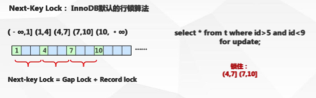

为什么是innodb 行锁的默认算法，

间隙锁（Gap）

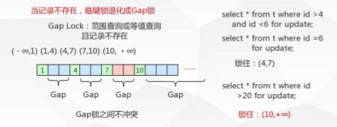

记录锁（Record）

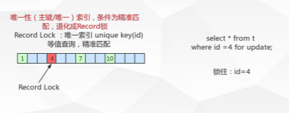

## 锁解决的问题
### 解决脏读问题

解决方式：B事务加上排它锁，A事务阻塞直到B事务处理完成后才能读取数据

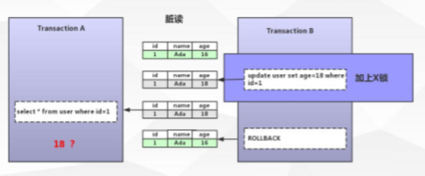

### 解决不可重复读问题

解决方式：A事务加上共享锁，B事务可以查询这条数据，但是无法修改，防止前后读取到的数据不一样

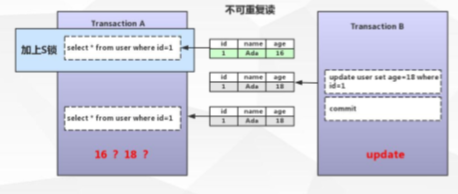

### 解决幻读问题
解决方式：A事务加了临键锁，B事务无法插入或删除age大于15的数据，防止幻读

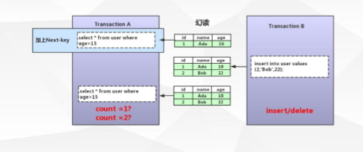
## 锁引发的问题 -- 死锁

### 介绍

- 多个并发事务（2个或者以上）
- 每个事务都持有锁（或者是已经再等待锁）
- 每个事务都需要再继续持有锁
- 事务之间产生加锁的循环等待，形成死锁。

### 避免

- 类似的业务逻辑以固定的顺序访问表和行
- 大事务拆小，大事务更倾向于思索，如果业务允许，将大事务拆小
- 在同一个事务中，尽可能做到一次锁定所需要的所有资源，减少思索概率
- 降低隔离级别，如果业务允许，调低隔离级别也是较好的选择
- 为表添加合理的索引，如果不走索引将会为表的每一行记录添加上锁（或者说是表锁）

查看mysql设置的事务隔离级别

``` sql
select @@global.tx_isolation;
select @@tx_isolation;
```


# 三 MVCC

- Multiversion concurrency control(多版本并发控制)
- 通俗的解释就是 并发访问（读/写）数据库时，对正在事务内处理的数据做多版本的管理。以达到用来避免写操作的堵塞，从而引发读操作的并发问题。

## MVCC逻辑流程-插入

表：teacher 

| 主键（自增） | 姓名 | 年龄 | 数据行的版本号 | 删除版本号 |
| ------------ | ---- | ---- | -------------- | ---------- |
| id           | name | age  | DB_TRX_ID      | DB_ROLL_PT |
|              |      |      |                |            |

setp：插入数据

``` shell
假设系统的全局事务ID号从1开始；
begin；      --拿到系统的事务ID=1
insert into teacher（name，age）VALUE（'seven','18'）；
insert into teacher（name,age）VALUE('qingshan','19');
commit;
```

表：teacher
| 主键（自增） | 姓名     | 年龄 | 数据行的版本号 | 删除版本号 |
| ------------ | -------- | ---- | -------------- | ---------- |
| id           | name     | age  | DB_TRX_ID      | DB_ROLL_PT |
| 1            | seven    | 18   | 1              | NULL       |
| 2            | qingshan | 19   | 1              | NULL       |


## MVCC逻辑流程-删除
表：teacher 

| 主键（自增） | 姓名     | 年龄 | 数据行的版本号 | 删除版本号 |
| ------------ | -------- | ---- | -------------- | ---------- |
| id           | name     | age  | DB_TRX_ID      | DB_ROLL_PT |
| 1            | seven    | 18   | 1              | NULL       |
| 2            | qingshan | 19   | 1              | NULL       |

setp：数据的删除

``` shell
假设系统的全局事务ID目前到了22
begin；      --拿到系统的事务ID=22
delete teacher where id=2；
commit;
```

表：teacher

| 主键（自增） | 姓名     | 年龄 | 数据行的版本号 | 删除版本号 |
| ------------ | -------- | ---- | -------------- | ---------- |
| id           | name     | age  | DB_TRX_ID      | DB_ROLL_PT |
| 1            | seven    | 18   | 1              | NULL       |
| 2            | qingshan | 19   | 1              | 22         |

## MVCC逻辑流程-修改
表：teacher 

| 主键（自增） | 姓名     | 年龄 | 数据行的版本号 | 删除版本号 |
| ------------ | -------- | ---- | -------------- | ---------- |
| id           | name     | age  | DB_TRX_ID      | DB_ROLL_PT |
| 1            | seven    | 18   | 1              | NULL       |
| 2            | qingshan | 19   | 1              | 22         |

setp：修改操作

``` shell
假设系统的全局事务ID目前到了33
begin；      --拿到系统的事务ID=33
update teacher set age=19 where id=1；
commit;
```

表：teacher

| 主键（自增） | 姓名     | 年龄 | 数据行的版本号 | 删除版本号 |
| ------------ | -------- | ---- | -------------- | ---------- |
| id           | name     | age  | DB_TRX_ID      | DB_ROLL_PT |
| 1            | seven    | 18   | 1              | 33         |
| 2            | qingshan | 19   | 1              | 22         |
| 1            | seven    | 19   | 33             | NULL       |

修改操作时先做命中的数据行的copy，将原行数据的删除版本号的值设置为当前事务ID(33)

## MVCC逻辑流程-查询
表：teacher

| 主键（自增） | 姓名     | 年龄 | 数据行的版本号 | 删除版本号 |
| ------------ | -------- | ---- | -------------- | ---------- |
| id           | name     | age  | DB_TRX_ID      | DB_ROLL_PT |
| 1            | seven    | 18   | 1              | 33         |
| 2            | qingshan | 19   | 1              | 22         |
| 1            | seven    | 19   | 33             | NULL       |

setp：插入数据

``` shell
假设系统的全局事务ID目前到了44
begin；      --拿到系统的事务ID=44
select * from users；
commit;
```
表：teacher

| 主键（自增） | 姓名     | 年龄 | 数据行的版本号 | 删除版本号 |
| ------------ | -------- | ---- | -------------- | ---------- |
| id           | name     | age  | DB_TRX_ID      | DB_ROLL_PT |
| 1            | seven    | 18   | 1              | 33         |
| 2            | qingshan | 19   | 1              | 22         |
| 1            | seven    | 19   | 33             | NULL       |

数据查询规则

1. 查找数据行版本早于当前事务版本的数据行（也就是行的系统版本号小于或等于事务的系统版本号），这样可以确保事务读取的行，要么是在事务开始前已经存在的，要么是事务自身插入或者修改果的
2. 查找删除版本号要么为null，要么大于当前事务版本号的记录，确保取出来的记录在事务开启之前没有被删除

## MVCC版本控制案例

数据准备：

```sql
insert into teacher(name，age)value（'seven','18'）；
...                                  qing，20
```

tx1:

```sql
begin;								---1
select * from users;                ---2
commit;                             
```

tx2:

```sql
begin;								----3
update teacher set age=28 where id=1;---4
commit；
```

案例1： 1，2，3，4 ，2

案例2 ：3，4，1，2

### 案例一

| 主键（自增） | 姓名     | 年龄 | 数据行的版本号 | 删除版本号 |
| ------------ | -------- | ---- | -------------- | ---------- |
| id           | name     | age  | DB_TRX_ID      | DB_ROLL_PT |
| 1            | seven    | 18   | 1              | NULL       |
| 2            | qingshan | 19   | 1              | NULL       |

 1，2执行之后   TXID =2数据查找 到的数据为第 3行和第四行

3，4执行之后得到结果

| 主键（自增） | 姓名     | 年龄 | 数据行的版本号 | 删除版本号 |
| ------------ | -------- | ---- | -------------- | ---------- |
| id           | name     | age  | DB_TRX_ID      | DB_ROLL_PT |
| 1            | seven    | 18   | 1              | 3          |
| 2            | qingshan | 19   | 1              | NULL       |
| 1            | seven    | 28   | 3              | NULL       |

2执行之后   数据查找 到的数据为第 4行和第5行 正确

### 案例二

| 主键（自增） | 姓名     | 年龄 | 数据行的版本号 | 删除版本号 |
| ------------ | -------- | ---- | -------------- | ---------- |
| id           | name     | age  | DB_TRX_ID      | DB_ROLL_PT |
| 1            | seven    | 18   | 1              | NULL       |
| 2            | qingshan | 19   | 1              | NULL       |

3，4执行之后的结果为

| 主键（自增） | 姓名     | 年龄 | 数据行的版本号 | 删除版本号 |
| ------------ | -------- | ---- | -------------- | ---------- |
| id           | name     | age  | DB_TRX_ID      | DB_ROLL_PT |
| 1            | seven    | 18   | 1              | 2          |
| 2            | qingshan | 19   | 1              | NULL       |
| 1            | seven    | 28   | 3              | NULL       |

1，2再执行  TXID=3 事务id比3，4执行的事务id大。查出第四行和第五行的数据，但是此时修改的事务还没有提交。出现了脏读现象。

这个问题不是由MVCC来解决。这个是由快照读来解决
## Undo log

1. 概念

- undo意为取消，以撤销操作位目的，返回制定某个状态的操作
- undo log 至事务开始之前，在操作任何数据之前，首先将需操作的数据本分到一个地方（Undo Log）

2. UndoLog是为了实现事务的原子性而出现的产物

3. UndoLog实现事务原子性;

- 事务处理过程中如果出现了错误或者用户执行了ROLLBACK语句，Mysql可以利用Undo Log中的备份将数据恢复到事务开始之前的状态

4. UndoLog在Mysql innodb存储引擎中用来实现多版本并发控制

5. Undo Log实现多版本并发控制：

- 事务未提交之前，undo保存了未提交之前的版本数据，undo中的数据可作为数据旧版本快照供其他并发事务进行快照读

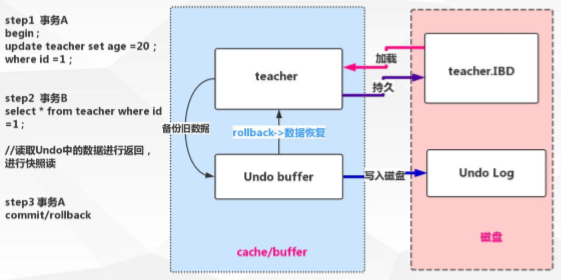

##### 当前读、快照读

快照读：

- SQL读取的数据是快照版本，也就是历史版本，普通的select就是快照读
- innodb快照读，数据的读取将由cache（原本数据）+undo（事务修改过的数据）两部分组成

当前读：

- SQL读取的数据是最新版本。通过锁机制来保证读取的数据无法通过其他事务进行修改
- update、delete、insert、select...LCOK IN SHATE MODE、select...for update都是当前读

## Redo log

1. 概念
   - Redo，顾名思义就是重做。以恢复操作为目的，重现操作；
   - Redo log指事务中操作的任何数据，将最新的数据备份到一个地方（Redo log）
2. Redo log的持久
   - 不是随着事务的提交才写入的，而是在事务的执行过程中，便开始写入redo中。具体的落盘策略可以配置
3. RedoLog是为了实现事务的持久性而出现的产物
4. Redo Log实现事务持久性
   - 防止在发生故障的时间点，尚有脏页未写入磁盘，在重启mysql服务的时候，根据redo log进行重做，从而达到事务的未入磁盘数据进行持久化这一特性。

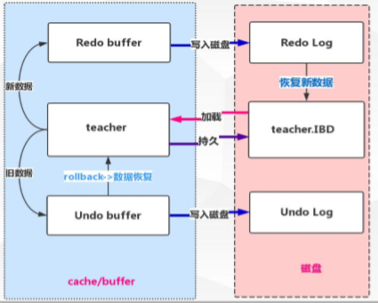

5. Redo log 相关知识点
   - 指定Redo log 记录在``{datadir}/ib_logfile1&ib_logfile2``   可通过``innodb_log_group_home_dir ``配置指定 目录存储
   - 一旦事务成功提交且数据持久化落盘之后，此时Redo log中的对应事务数据记录就失去了意义，所 以Redo log的写入是日志文件循环写入的 
     - 指定Redo log日志文件组中的数量 ``innodb_log_files_in_group ``默认为2
     - 指定Redo log每一个日志文件最大存储量``innodb_log_file_size``  默认48M 
     - 指定Redo log在``cache/buffer``中的buffer池大小``innodb_log_buffer_size`` 默认16M
   - Redo buffer持久化Redo log的策略，`` Innodb_flush_log_at_trx_commit``：
     -  取值 0  每秒提交 ``Redo buffer``  -->  ``Redo log  OS cache`` -->``flush cache to disk``[可能丢失一秒内 的事务数据] 
     - 取值 1  默认值，每次事务提交执行``Redo buffer``  -->  ``Redo log  OS cache`` -->``flush cache to disk`` [最安全，性能最差的方式] 
     - 取值 2  每次事务提交执行``Redo buffer``  -->  ``Redo log  OS cache `` 再每一秒执行 ->``flush cache to disk``操作

# 四 配置优化

